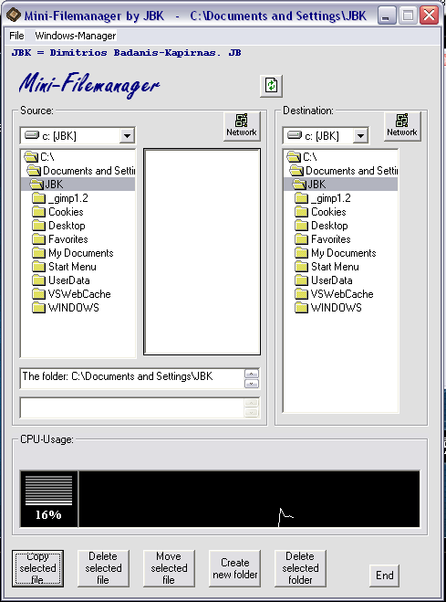



## Mini\-Filemanager

### Description

** Mini-Filemanager3 **

WITH CPU-USAGE!!!!!!!

Try it out! Its a full filemanager.You can

delete, move , copy files, Create,delete Folders!

Good way to learn about file managing with

VB for newbies(like me :-) You can start applications

and all files by dblclicking on the file!

Also, if you think i deserve a vote then please vote me!

:-)
 
### More Info
 
I havent found out how to delete folders with files in them!

If you know how, PLEASE let me know

jbk@mail.gr

I have many trash in the source!

             |
---                |---
**Submitted On**   |2002-01-23 19:03:10
**By**             |[JBK](https://github.com/Planet-Source-Code/PSCIndex/blob/master/ByAuthor/jbk.md)
**Level**          |Beginner
**User Rating**    |4.8 (29 globes from 6 users)
**Compatibility**  |VB 5\.0, VB 6\.0
**Category**       |[Complete Applications](https://github.com/Planet-Source-Code/PSCIndex/blob/master/ByCategory/complete-applications__1-27.md)
**World**          |[Visual Basic](https://github.com/Planet-Source-Code/PSCIndex/blob/master/ByWorld/visual-basic.md)
**Archive File**   |[Mini\-Filem509031252002\.zip](https://github.com/Planet-Source-Code/jbk-mini-filemanager__1-30952/archive/master.zip)

